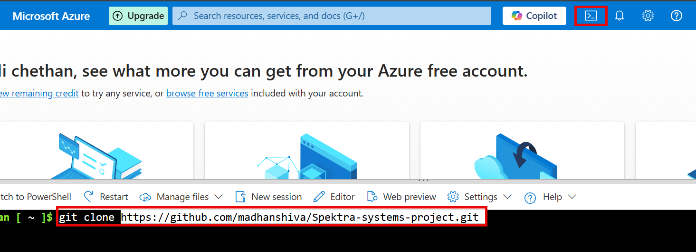
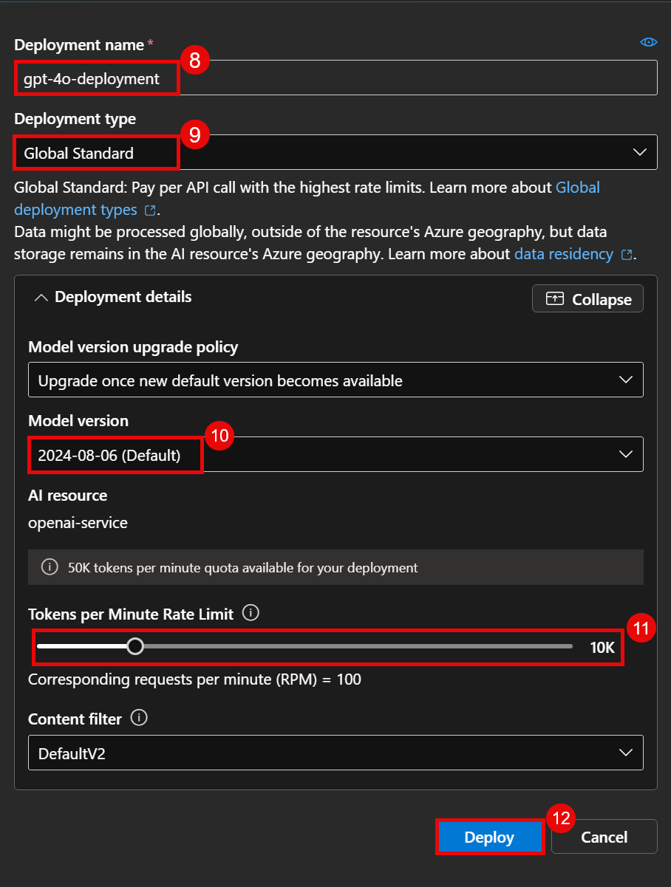

# Design and Deploy a Serverless API Ecosystem on Azure using Azure Functions and API Management

## Overview

To design and deploy a secure, scalable, and maintainable serverless API ecosystem on Microsoft Azure that enables efficient creation and management of IT incident tickets. The solution leverages Azure Functions for serverless compute, Azure API Management (APIM) for API gateway capabilities including governance, throttling, and security, and integrates with Azure OpenAI to automatically generate intelligent resolution suggestions. This ecosystem includes monitoring and analytics tools to ensure operational visibility, performance.

## Prerequisites

  - An Azure account with an active subscription. [Create/Login Azure account](https://portal.azure.com/#home)

## Getting Started With Lab

1. Click on this link to [Login to azure account](https://portal.azure.com/#home)

2. You'll see the **Sign into Microsoft Azure** tab. Here, enter your credentials
   
      - **Email/username:** `madhanmv580@gmail.com`
      
        


3. Next, Provide your password

   - **Password:** `azurepswd!`
     
      


4. If prompted to stay signed in , click **NO**

1. Clone the git repository

   ```
   git clone https://github.com/madhanshiva/Spektra-systems-project.git

   ```
   
2. Click on the cloud shell and paste the git url and press enter.

   

3. Follow the below details

   ```
   cd Spektra-systems-project/ARM/AZURE-MONITOR
   az deployment group validate --resource-group shiva.kumarmv --template-file arm-monitor.json --parameters arm-monitor-param.json
    ```

4. Once the deployment completed back to root folder and execute the below command

   ```
   cd Spektra-systems-project/ARM/AZURE-FUNCTION-API
   az deployment group validate --resource-group shiva.kumarmv --template-file azure-function-api-param.json --parameters azure-function.json
   ```

5. Verfiy all services present in the resource group.

   

6. Click on the openai-service it takes to Azure openai home page.
   
   

7. On overview of azure openai on top click on **Go to azure AI Foundry Portal** it takes to new tab.

   

8. Under model deployment click on + button and select **Deploy base mobel**

    


9. On left search bar type **gpt-4o** , scroll down and select and click confirm.

    

10. Fill the following deployment details and click on deploy.

    Deployment name : gtp-4o-deployment
    Deployment type : global Standard
    Model version : default
    Tokens : 10k

    
     

11. once deployment is done copy the Endpoint and Key and paste in notepad later we will use.

    

     
