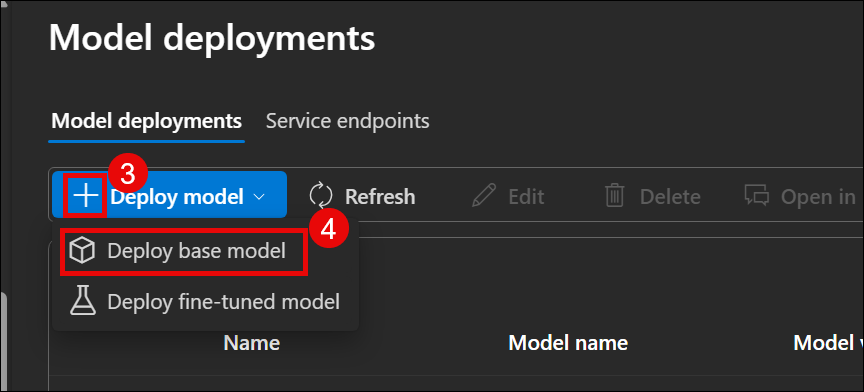

# Design and Deploy a Serverless API Ecosystem on Azure using Azure Functions and API Management

## Overview

To design and deploy a secure, scalable, and maintainable serverless API ecosystem on Microsoft Azure that enables efficient creation and management of IT incident tickets. The solution leverages Azure Functions for serverless compute, Azure API Management (APIM) for API gateway capabilities including governance, throttling, and security, and integrates with Azure OpenAI to automatically generate intelligent resolution suggestions. This ecosystem includes monitoring and analytics tools to ensure operational visibility, performance.

## Prerequisites

  - An Azure account with an active subscription. [Create/Login Azure account](https://portal.azure.com/#home)

## Getting Started With Lab

1. Click on this link to [Login to azure account](https://portal.azure.com/#home)

2. You'll see the **Sign into Microsoft Azure** tab. Here, enter your credentials
   
      - **Email/username:** `madhanmv580@gmail.com`
      
        


3. Next, Provide your password

   - **Password:** `azurepswd!`
     
      


4. If prompted to stay signed in , click **NO**

5. Clone the Project via Cloud Shell

    - Click the *Cloud Shell* icon (top-right in Azure Portal).
    -  Run the following command in the terminal:
      
    ```
    git clone https://github.com/madhanshiva/Spektra-systems-project.git
    ```
    
   
6. Follow the below details

   ```
   cd Spektra-systems-project/ARM/AZURE-MONITOR
   az deployment group validate --resource-group shiva.kumarmv --template-file arm-monitor.json --parameters arm-monitor-param.json
   ```

7. Once the deployment completed back to root folder and execute the below command

   ```
   cd Spektra-systems-project/ARM/AZURE-FUNCTION-API
   az deployment group validate --resource-group shiva.kumarmv --template-file azure-function-api-param.json --parameters azure-function.json
   ```
8. View Azure Resource Group & Resources

    - Open Resource Group

    - In the Azure Portal, select the resource group:  
  *shiva.kumarmv*

    - View Resources

    | Resource Name        | Type                      | Location     |
    |----------------------|---------------------------|--------------|
    | api-ticket-services5 | API Management service     | West Europe  |
    | openai-service       | Azure OpenAI               | West Europe  |
    | ticketanalytics58    | Log Analytics workspace    | West Europe  |
    | ticketfun58098       | Application Insights       | West Europe  |
    | ticketfun58098       | Function App               | West Europe  |

    
    
9. Open Azure OpenAI Resource

    - In the resource group view, click on *openai-service* (Type: Azure OpenAI).

10. Open Azure AI Foundry Portal

    
  
    - In the *openai-service* overview page, click on *Go to Azure AI Foundry portal*.

    


11. Start a New OpenAI Model Deployment

    - In the *Model deployments* tab, click *➕ Deploy model*.
    - From the dropdown, select *Deploy base model*.

      
      
12. Select GPT-4o Model

    - In the search bar, type gpt-4o.
    - Select the *gpt-4o* model with the *Chat completion* task.
    - Click *Confirm*.

      


13. Final Steps to Deploy GPT-4o Model
  
    | Setting                    | Value                        |
    |----------------------------|------------------------------|
    | Deployment Name            | gpt-4o-deployment          |
    | Deployment Type            | Global Standard              |
    | Model Version              | 2024-08-06 (Default)         |
    | Tokens per Minute Limit    | 10K                          |
  
    - Click *Deploy* to complete the deployment process.

    

    > Once deployed, you can use this model via endpoint and key in your apps.


14. Get Your OpenAI Endpoint and Key
  
    - *Target URI*: Copy the endpoint URL for use in your application.
    - *Key*: Click the copy icon next to the key to use it for authentication.
  
      

      > *Important:* Keep your key secure and do not expose it publicly.

16. View Function App (ticketfun58098)

    - Go to *Resource Group: shiva.kumarmv*.
    - Scroll and find *ticketfun58098* with the ⚡ Function App icon.
    - Click it to open and manage the Function App.

      


17. Add an Environment Variable in Function App

    - Expand the *Settings* section.
    - Click on *Environment variables*.
    - Click *➕ Add*.
    - Enter the *Name* and *Value, then click **Apply*.

      

18. Add Azure OpenAI Endpoint Variable

    - *Name*: AZURE_OPENAI_ENDPOINT  
    - *Value*: Paste your OpenAI endpoint URL  
    - Click *Apply* to save.

      

        > Importanat : Do it for AZURE_OPENAI_KEY as well

19. Save the New App Setting

    - After adding the variable, click *Apply* again at the bottom.
    - In the popup, click *Confirm* to save changes.

      
    
    > The app may restart after applying changes.

20. Add a New API in API Management

    - Go to *api-ticket-services5* (API Management).
    - Expand the *APIs* section.
    - Click *➕ Add API*.

      

21. Import Function App as an API

    - Under *Create from Azure resource, select the **Function App* tile.

      

22. Link a Function App to API Management

    - Click *Browse*.
    - Select ticketfun58098 from the list.

      

      
      


24. Select Your Function App

    - Click on *ticketfun58098* from the list.
    - Click *Select* at the bottom to confirm.
   
      
      
23. Finalize Function App Selection

    - After choosing your Function App, click *Select* to load available endpoints.
   
    - 

    
23. Select the Function to Expose via API

    - Check the box next to function1.
    - Click *Select* to proceed.

      

      > This links function1 to be exposed via API Management.

    

22. Create the API from Function App

    - In *API URL suffix*, enter: v1
    - Click *Create* to publish the API.
   
      
       
      >  Your API will now be accessible at:  
      > https://api-ticket-services5.azure-api.net/v1

---
